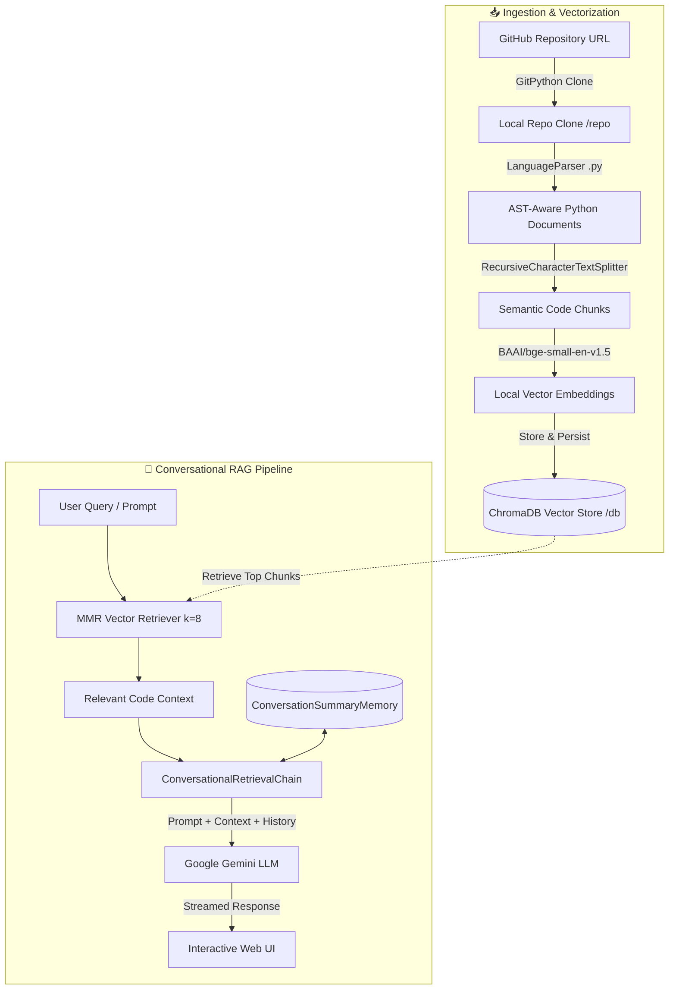

# ⚡ CodeMind · RealTime Source Code Analyzer

<p align="center">
  
</p>

<p align="center">
  <strong>An Intelligent, Conversational RAG System to Ingest, Parse, and Query GitHub Repositories in Real Time</strong>
</p>

<p align="center">
  <a href="https://www.python.org/downloads/"></a>
  <a href="https://www.langchain.com/"></a>
  <a href="https://ai.google.dev/"></a>
  <a href="https://www.trychroma.com/"></a>
  <a href="https://huggingface.co/BAAI/bge-small-en-v1.5"></a>
  <a href="https://flask.palletsprojects.com/"></a>
  <a href="LICENSE"></a>
</p>

---

## 📌 Overview

**CodeMind (RealTime Source Code Analyzer)** is a production-ready developer assistant powered by **Retrieval-Augmented Generation (RAG)**. It allows developers, engineers, and researchers to ingest any public GitHub repository dynamically, automatically parse its Abstract Syntax Tree (AST), create high-dimensional vector embeddings locally, and converse interactively with the codebase.

Whether onboarding onto a massive legacy codebase, auditing security patterns, or seeking specific functional implementations, CodeMind delivers precise, context-aware answers with file and code references in real time.

---

## ✨ Key Features

- **⚡ On-Demand GitHub Ingestion**: Dynamic cloning and indexing of any public GitHub repository on the fly via `GitPython`.
- **🧩 AST-Aware Python Parsing**: Leverages LangChain's `LanguageParser` with Python AST grammar to preserve class definitions, functions, and contextual metadata instead of raw, naive text slicing.
- **🛡️ Local High-Performance Embeddings**: Employs `BAAI/bge-small-en-v1.5` via HuggingFace for fast, accurate embeddings running directly on your CPU/GPU without third-party rate limits or embedding API fees.
- **🔍 Maximum Marginal Relevance (MMR) Retrieval**: ChromaDB vector store configured with MMR search (`k=8`) to fetch diverse, high-relevance code chunks while avoiding redundancy.
- **🧠 Multi-Turn Conversational Memory**: LangChain's `ConversationSummaryMemory` coupled with **Google Gemini (`gemini-3.6-flash`)** ensures persistent context retention across long debugging and exploratory sessions.
- **🎨 Modern Cyber-Dark Interface**: Glassmorphism UI styled with CSS design tokens, glowing micro-interactions, responsive chat bubbles, and real-time status indicators.

---

## 🏗️ Architecture & RAG Pipeline



---

## 🛠️ Tech Stack

| Component | Technology | Purpose |
| :--- | :--- | :--- |
| **LLM Engine** | [Google Gemini (`gemini-3.6-flash`)](https://ai.google.dev/) | High-speed reasoning, conversational synthesis, and code explanation |
| **Embedding Model** | [BAAI/bge-small-en-v1.5](https://huggingface.co/BAAI/bge-small-en-v1.5) | Local dense vector representations (384-dim, normalized) |
| **Vector Database** | [ChromaDB](https://www.trychroma.com/) | Persistent local vector storage and MMR similarity search |
| **RAG Framework** | [LangChain](https://www.langchain.com/) | Document loaders, text splitters, memory buffers, and retrieval chains |
| **Ingestion Engine** | [GitPython](https://gitpython.readthedocs.io/) | Automated remote Git repository cloning |
| **Backend Framework** | [Flask](https://flask.palletsprojects.com/) | RESTful API routing and server-side request processing |
| **Frontend UI** | HTML5, Vanilla CSS3, JavaScript, jQuery | Glassmorphism dark theme, AJAX communication, responsive layout |

---

## 📂 Project Structure

```plaintext
RealTime-Source-Code-Analyzer/
├── src/
│   ├── __init__.py          # Package initialization
│   └── helper.py            # Ingestion, AST loading, text splitting & embedding pipelines
├── templates/
│   └── index.html           # Modern dual-panel web interface (Repo Input + Live Chat)
├── static/
│   └── style.css            # Dark glassmorphism styling & micro-animations
├── research/
│   └── trials.ipynb         # Jupyter notebook for RAG experiments & model validation
├── app.py                   # Main Flask application & ConversationalRetrievalChain server
├── store_index.py           # Vector database indexing & persistence script
├── setup.py                 # Local package installer configuration
├── requirements.txt         # Production dependencies
├── .env                     # Environment variables (API keys)
├── .gitignore               # Git ignored directories (repo/, db/, virtual envs)
├── LICENSE                  # MIT License
└── README.md                # Project documentation
```

---

## 🚀 Getting Started

### Prerequisites

- **Python**: Version `3.10` or higher
- **Git**: Installed and available on system PATH
- **Google Gemini API Key**: Obtainable free at [Google AI Studio](https://aistudio.google.com/)

---

### Step 1: Clone the Repository

```bash
git clone https://github.com/Sid-LD/RealTime-Source-Code-Analyzer.git
cd RealTime-Source-Code-Analyzer
```

---

### Step 2: Create & Activate a Virtual Environment

Using **Conda**:
```bash
conda create -n codemind python=3.10 -y
conda activate codemind
```

*Or using **venv**:*
```bash
python -m venv venv
# On Windows:
venv\Scripts\activate
# On Linux/macOS:
source venv/bin/activate
```

---

### Step 3: Install Dependencies

```bash
pip install -r requirements.txt
```

> **Note**: For GPU-accelerated embeddings with CUDA, install the PyTorch build corresponding to your hardware from [pytorch.org](https://pytorch.org/).

---

### Step 4: Configure Environment Variables

Create a `.env` file in the root directory:

```env
GOOGLE_API_KEY=your_actual_google_gemini_api_key_here
```

---

### Step 5: Launch the Application

```bash
python app.py
```

The application will start locally at:
👉 **`http://localhost:8080`** (or `http://127.0.0.1:8080`)

---

## 💡 How to Use

1. **Ingest a Repository**:
   - Paste any public GitHub repository link (e.g. `https://github.com/pallets/flask` or `https://github.com/psf/requests`) into the top input bar.
   - Click **Send**. The server will clone the repository, extract Python code chunks, generate BGE embeddings, and index them into ChromaDB.

2. **Interact with the Codebase**:
   - Type your questions into the chat box at the bottom.
   - The assistant retains memory of previous questions, allowing follow-ups and deep architectural dives.

3. **Reset Repository**:
   - Type `clear` in the chat to purge the cached local repository directory.

---

## 🔍 Sample Prompts to Try

- 🏗️ *"Explain the high-level architecture and list the main entry points of this repository."*
- 🔐 *"How is authentication or session management implemented in this codebase?"*
- 🐞 *"Identify potential edge cases or unhandled exceptions in the request processing pipeline."*
- 🧪 *"Write unit tests using pytest for the core functions in helper.py."*
- ⚡ *"How can the database queries in this project be optimized for better throughput?"*

---

## 🔌 API Endpoints Reference

| Endpoint | Method | Payload | Description |
| :--- | :--- | :--- | :--- |
| `/` | `GET` | None | Renders the primary web interface |
| `/chatbot` | `POST` | `question=<repo_url>` | Clones the target GitHub repo and triggers vector indexing |
| `/get` | `POST` | `msg=<user_message>` | Queries the RAG Conversational Retrieval Chain and returns the LLM response |

---

## 🛣️ Roadmap

- [ ] **Multi-Language Support**: Extend AST parsers to JavaScript, TypeScript, Go, Rust, Java, and C++.
- [ ] **Interactive Code Graph**: Generate visual dependency and call-hierarchy graphs in the browser.
- [ ] **Automated PR Reviewer**: Automated pull request diff analysis and inline code review suggestions.
- [ ] **Dockerized Deployment**: One-command containerized deployment via Docker and Docker Compose.

---

## 📄 License

This project is licensed under the **MIT License** — see the [LICENSE](LICENSE) file for complete details.

---

## 👤 Author

**Siddhant (Sid-LD)**
- 🐙 GitHub: [@Sid-LD](https://github.com/Sid-LD)
- 📧 Email: [siddhantroy2006@gmail.com](mailto:siddhantroy2006@gmail.com)

---

<p align="center">
  <sub>Built with ❤️ using LangChain, Google Gemini, and ChromaDB</sub>
</p>